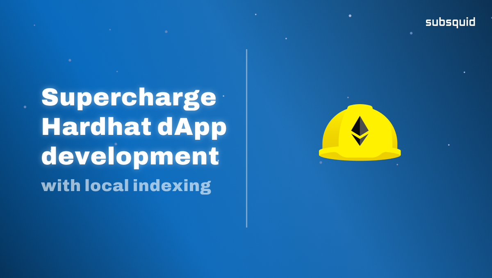

# Index a local EVM node (Hardhat, Ganache, Truffle, Anvil...)

<p align="center">
	
</p>

<div align="center">

[Twitter](https://twitter.com/subsquid) | [Discord](https://discord.gg/subsquid) | [LinkedIn](https://linkedin.com/subsquid) | [Telegram](https://t.me/HydraDevs) | [GitHub](https://github.com/subsquid) | [YouTube](https://www.youtube.com/@subsquid)

</div>

## Introduction

Blockchain data indexing is a performance enhancer for dApps, but it's a pain to develop your application locally, because, somehow, **no one thought about indexing a local EVM node…** 😡😤

> …Until Subsquid decided to put an end to this.

This repository shows that thanks to Subsquid, developers can build their dApp by building their smart contract locally, deploying it on a local node, and indexing that local node with a squid. 

This leads to a development and testing cycle with much tighter iterations.

Furthermore, since the indexing middleware is present from the start, fewer changes have to be made (just changing the `chain`, `address`, and the contract address itself).

## Walkthrough

To follow a complete walkthrough and better understand what this repository does, and how it can be adapted to your needs, please [read this article on Medium](https://medium.com/@raekwonthethird/boost-your-dapp-development-productivity-with-local-indexing-3936ba7a8cec).

## What is a Squid?

> A squid is a project that extracts and transforms on-chain data in order to present it as a GraphQL API. Squids are developed using the Subsquid SDK, which provides extensive tooling to define data schemas, data transfomation rules, and the shape of the resulting API.

We recommend that you read Subsquid docs to understand how it works: https://docs.subsquid.io/

## Prerequisites

- Node 16.x
- Docker
- NPM

## Key components

* The `schema.graphql` file is used to define the database and API schemas. A command line tool will automatically generate code from it, which you can find in `src/model/generated`
* The `db/migrations` folder contains automatically files with SQL statements to modify the database (create, alter, delete tables), similarly to any ORM database interface.
* The `src/abi` folder contains facade TypeScript code, automatically generated by a command line tool from one, or multiple smart contract ABI(s). This code is used to programmatically interface with the smart contract(s) and decode events and function calls.
* The main logic of this project is defined in `src/processor.ts`. The `EvmBatchProcessor` class is configured and used to perform request to [Subsquid's Archive for Ethereum blockchain](https://app.subsquid.io/archives), to obtain necessary data. Then some custom logic is implemented to process this data in batches, and save it on the database with the custom defined structure.

[Subsquid documentation](https://docs.subsquid.io/) has dedicated sections and pages describing each of these concepts, it is advised to consult them, before starting to develop your own squid.

## Development flow

### 1. Define database schema

Start development by defining the schema of the target database via `schema.graphql`.
Schema definition consists of regular graphql type declarations annotated with custom directives.
Full description of `schema.graphql` dialect is available [here](https://docs.subsquid.io/schema-spec).

### 2. Generate TypeORM classes

Mapping developers use TypeORM [EntityManager](https://typeorm.io/#/working-with-entity-manager)
to interact with target database during data processing. All necessary entity classes are
generated by the squid framework from `schema.graphql`. This is done by running `npx sqd codegen`
command.

### 3. Generate database migrations

All database changes are applied through migration files located at `db/migrations`.
`squid-typeorm-migration(1)` tool provides several commands to drive the process.

```bash
## delete all migrations
rm -rf db/migrations/*.js

## drop create the database
make down
make up

## create a new schema migration from the entities
npx squid-typeorm-migration generate      
```

See [docs on schema updates](https://docs.subsquid.io/develop-a-squid/schema-file/schema-updates/) for more details.

### 4. Import ABI contract and generate interfaces to decode events

It is necessary to import the respective ABI definition to decode EVM logs. 

To generate a type-safe facade class to decode EVM logs, place the ABI in the `assets` folder and use `squid-evm-typegen(1)`, e.g.:

```bash
npx squid-evm-typegen src/abi assets/ERC721.json#erc721
```

For more details about `squid-evm-typegen` read the [docs page](https://docs.subsquid.io/develop-a-squid/typegen/squid-evm-typegen/)

## Project conventions

Squid tools assume a certain project layout.

* All compiled js files must reside in `lib` and all TypeScript sources in `src`.
The layout of `lib` must reflect `src`.
* All TypeORM classes must be exported by `src/model/index.ts` (`lib/model` module).
* Database schema must be defined in `schema.graphql`.
* Database migrations must reside in `db/migrations` and must be plain js files.
* `sqd(1)` and `squid-*(1)` executables consult `.env` file for a number of environment variables.

## GraphQL server extensions

It is possible to extend `squid-graphql-server(1)` with custom
[type-graphql](https://typegraphql.com) resolvers and to add request validation. See [the docs](https://docs.subsquid.io/develop-a-squid/graphql-api/custom-resolvers/) for more details.
